# Live to Eat Food

Design concept and brand book for **Live to Eat Food**, Tina's creator-led food discovery platform for Worcester and Central Massachusetts.

This is not a food blog and not a smaller Yelp. Every screen answers one question, *where should we eat?*, with a real person's judgment on top and a way to get there underneath.

**Live preview (GitHub Pages):** <https://cptnope.github.io/Live-to-Eat-Food/>

| Page | File | What it shows |
|---|---|---|
| Home | [`index.html`](index.html) | A working craving sentence that rebuilds the street of places as you change it, Let Tina pick, Watch + Eat, the interactive map, guides, the Sunday list, the editorial policy, the owner path |
| Explore | [`explore.html`](explore.html) | All 21 places: filter with the same sentence, sort, save, and jump any row onto the map |
| Tina | [`tina.html`](tina.html) | Who Tina is, where she posts, her latest posts as saveable places, and how she picks |
| Place page | [`place.html`](place.html) | A restaurant as a three-floor editorial feature (American Flatbread Co, 85 Green St) |
| Guide | [`guide.html`](guide.html) | "New since 2025, and Tina's already been": three openings as a route of house numbers |
| Brand book | [`brand.html`](brand.html) | The system on one page: idea, logo, color, type, Tina's hand, trust labels, components, photography, voice |

> **Concept status.** Tina's notes are short excerpts from her own public TikTok captions, each linked to the original post. Restaurants, addresses and facts are real and sourced below. Photo frames are art-direction placeholders, not photos. Pages carry `noindex` so the concept doesn't appear in search results.

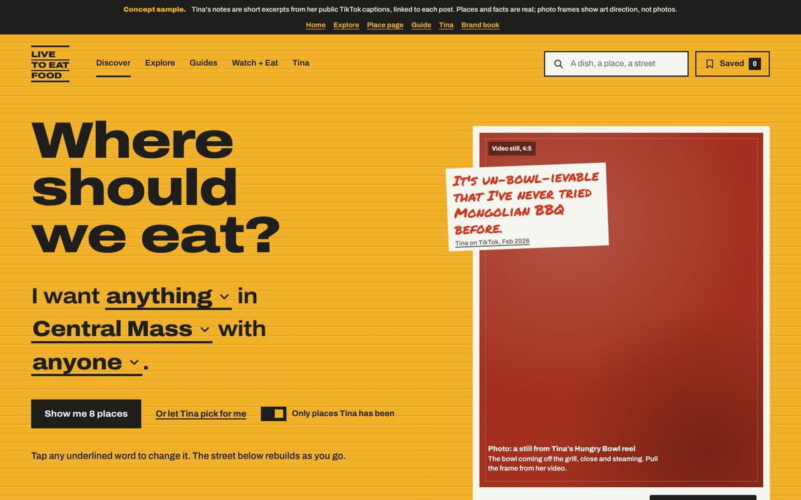

---

## Contents

1. [The idea](#1-the-idea-every-place-is-a-triple-decker)
2. [Logo](#2-logo)
3. [Color](#3-color)
4. [Neighborhoods and local texture](#4-neighborhoods-and-local-texture)
5. [Typography](#5-typography)
6. [Layout](#6-layout)
7. [Components](#7-components)
8. [Tina's hand](#8-tinas-hand)
9. [Trust and labels](#9-trust-and-labels)
10. [Photography and video](#10-photography-and-video)
11. [Voice and copy](#11-voice-and-copy)
12. [Iconography](#12-iconography)
13. [Motion and interaction](#13-motion-and-interaction)
14. [Accessibility](#14-accessibility)
15. [Screens](#15-screens)
16. [Content, facts and sources](#16-content-facts-and-sources)
17. [Repository structure](#17-repository-structure)
18. [Toward the WordPress build](#18-toward-the-wordpress-build)

---

## 1. The idea: every place is a triple-decker

Worcester is a city of triple-deckers: three stacked flats, painted siding, white window trim, a number by the door. The brand borrows that building as its **grammar**, not as an illustration.

| Floor | Holds | Rule |
|---|---|---|
| **Top floor** | Tina's take: the note, the verdict, the story | Her opinion always sits highest. An ad never occupies the top floor. |
| **Middle floor** | The food: photography, dishes, what she ordered | Food is the visual hero. |
| **Street level** | The door: address, hours, directions, menu, reserve | The thing you act on is always at street level. |

Use this order for every place module, from a 300px card to a full place page.

### Five devices carry the grammar

| Device | What it is | Where it goes |
|---|---|---|
| Siding fields | Whole regions painted `mustard`, `blue`, `green`, `brick` or `asphalt`, with lapped clapboard lines | Section grounds, place modules, guide covers |
| Window trim | A `trim` casing (8–12px) around every photo | All photography and video stills |
| House-number plates | Condensed numerals on an `asphalt` plate with 3px corners | Next to every place name, on map pins, on guide routes |
| The street | A 16px `asphalt` curb that places stand on, street names below | Rows of places, route lines |
| Tina's paper | A scrap of `trim` paper with her marker note, rotated about -2° | One per view, top floor only |

**Positioning line:** *A real local person you already trust found this, ate here, talked to the people behind it, and made it easy for you to go.*

**Brand promise:** *Restaurants can't buy Tina's opinion.*

---

## 2. Logo

The wordmark is the name stacked in three floors, with a heavy cornice and foundation rule and lighter floor rules between. Set in Archivo, weight 900, width 125, outlined to paths.

| File | Ink | Use on |
|---|---|---|
| [`assets/logos/ltef-wordmark-asphalt.svg`](assets/logos/ltef-wordmark-asphalt.svg) | asphalt | `trim`, `mustard` |
| [`assets/logos/ltef-wordmark-trim.svg`](assets/logos/ltef-wordmark-trim.svg) | trim | `blue`, `green`, `brick`, `asphalt` |
| [`assets/logos/ltef-avatar-mustard.svg`](assets/logos/ltef-avatar-mustard.svg) | asphalt on mustard | Social avatars, app icon, favicon |
| [`assets/logos/ltef-lockup-line.svg`](assets/logos/ltef-lockup-line.svg) | asphalt | One-line lockup, only where height is under 32px |
| [`assets/logos/plate-38.svg`](assets/logos/plate-38.svg) | trim on asphalt | Sample house-number plate proportions |

- Clear space is the height of one floor on every side. Minimum width 64px for the stacked mark.
- In HTML headers and footers use the live CSS wordmark so the text stays selectable:
  `<a class="logo" href="/"><span>LIVE</span><span>TO EAT</span><span>FOOD</span></a>` (add `light` on dark fields).
- Never recolor one floor separately, add a roof, fork or map pin, set the mark on a photo, or set the name on one line in mixed weights.

---

## 3. Color

The palette is **painted siding**, used at page scale. One field color owns each region; several siding colors appear together only in a row of houses.

| Token | Hex | Role | Text on it |
|---|---|---|---|
| `asphalt` | `#1E1F1C` | Ink. Text, roofs, curbs, plates, buttons, the night field (Watch + Eat, footer) | trim |
| `asphalt-2` | `#2B2C28` | Raised surface inside asphalt (active video row) | trim |
| `trim` | `#F6F6F1` | Reading ground, photo casing, Tina's paper | asphalt |
| `trim-2` | `#E7E7DF` | Quiet dividers, sponsored slots, inset casings | asphalt |
| `ink-2` | `#4A4C45` | Secondary text on trim (8.0:1) | — |
| `ink-3` | `#6B6D64` | Dashed "not yet" outlines, placeholders (4.9:1); never body copy | — |
| `mustard` | `#F2B027` | Signature siding, the front door: home hero, Sunday list, Shrewsbury St | asphalt (8.7:1), never trim |
| `mustard-ink` | `#3A2A00` | Secondary text and dashed outlines on mustard (7.3:1) | — |
| `blue` | `#2A4A6B` | Porch blue: Downtown, guides, Verified label | trim (8.5:1) |
| `green` | `#2E5B45` | Porch green: Park Ave and west side, people stories | trim (7.2:1) |
| `brick` | `#9C2F22` | Canal District, the editorial-policy sign | trim (6.8:1) |
| `blue-lt` / `green-lt` / `brick-lt` | `#B9CCD8` / `#C4CFB3` / `#E8C4B4` | Faded siding for towns outside Worcester | asphalt only |
| `tina` | `#D2341A` | **Tina's marker only.** 4.6:1 on trim; fails on every siding color, so it always sits on trim paper | — |

- **Color strategy:** full palette at page scale. Fields own whole regions; no scattered accents.
- **Never** use `tina` red for a link, button, sale banner, alert or ad.
- **Focus ring:** 3px `asphalt` outline at 2px offset plus a 5px `trim` halo, so one of the two reads at 3:1 or better on every field.
- **Clapboard texture:** lapped boards every 16px: a 2px darker lap line plus a 1px highlight (`--clap` on light siding, `--clap-lt` on dark). Never on the asphalt video field.
- Machine-readable tokens: [`design/tokens.json`](design/tokens.json).

---

## 4. Neighborhoods and local texture

Color tells you where a place is before you read the address. Every place takes the siding of its area on its house module, map patch, nearby tiles and place-page header.

| Area | Siding |
|---|---|
| Shrewsbury Street (Restaurant Row) | `mustard` |
| Downtown (Franklin St, Main St) | `blue` |
| Canal District and Kelley Square | `brick` |
| Park Ave and the west side | `green` |
| Main South, Grafton Hill, Vernon Hill, others | Assign from the four as coverage grows; never add a fifth siding color |
| Towns: Shrewsbury, Auburn, Holden, Grafton, Westborough, Hudson, Marlborough | Faded siding (`blue-lt`, `green-lt`, `brick-lt`) |

**The map, "Eat your way through Central Mass."** Worcester at the center with neighborhoods as siding patches; towns on dashed drive-time rings (roughly 10, 20 and 30 minutes) along the roads people actually take: Route 9, Route 20, I-290, I-190. Pins are house-number plates, not teardrops. Towns Tina hasn't covered yet are dashed labels, an honest to-do list.

**Lean on:** street numbers as identity (38 Franklin St, 82 Winter St, 72 and 155 Shrewsbury St), Worcester Lunch Car Company diners (the Boulevard Diner at 155 Shrewsbury St, built 1936, car no. 730), triple-decker siding and trim, seasons (patio season, first snow, college move-in, parents' weekend).

**Never:** lobsters, clam shacks, colonial lettering, Boston skyline, Red Sox references, "wicked" as a gimmick, New England plaid.

---

## 5. Typography

Three voices, never mixed inside one element.

| Voice | Face | Use |
|---|---|---|
| **Signage** | [Archivo](https://fonts.google.com/specimen/Archivo) (variable, width 62–125, weight 100–900) | Headlines at width 125; house numbers at width 62; interface at width 100–108 |
| **Reading** | [Source Serif 4](https://fonts.google.com/specimen/Source+Serif+4) | Tina's takes, stories, ledes, policy copy |
| **Tina's hand** | [Permanent Marker](https://fonts.google.com/specimen/Permanent+Marker) | Her notes and dish verdicts only |

```html
<link rel="stylesheet" href="https://fonts.googleapis.com/css2?family=Archivo:wdth,wght@62..125,100..900&family=Source+Serif+4:ital,opsz,wght@0,8..60,400..700;1,8..60,400..700&family=Permanent+Marker&display=swap">
```

### Type scale

| Style | Class | Size / line height | Weight · width | Use |
|---|---|---|---|---|
| Display XL | `.d-xl` | 46–96px / 0.92 | 850 · 125% | One per page: the craving question, a place name, the policy sign |
| Display L | `.d-l` | 34–64px / 0.95 | 820 · 125% | Section headlines |
| Display M | `.d-m` | 26–40px / 1.0 | 800 · 118% | Guide covers, stop names |
| Display S | `.d-s` | 22px / 1.1 | 780 · 112% | Card and module titles |
| Sentence | `.sentence` | 26–42px / 1.5 | 700 · 112% (slots 830) | The craving sentence |
| House number | `.num`, `.plate .n` | 46–150px / 0.82 | 820 · 62% | Addresses only, never prices, counts or ranks |
| Lede | `.lede` | 18–21px / 1.55 | Serif 400 | Section intros, max 34em |
| Body | `.body` | 18px / 1.62 | Serif 400 | Takes and stories, max 36em |
| UI | buttons, nav | 15–16px / 1.45 | 600–720 · 100–108% | Controls |
| Meta | `.meta` | 14px / 1.4 | 560 · 96% | Addresses, cuisine, price band, freshness |
| Note | `.note`, `.hand` | 20–25px / 1.16 | Marker | Tina's one-line notes |
| Verdict | `.verdict` | 19px / 1.1 | Marker | Dish verdicts |

- Sentence case for headlines and buttons. No all-caps labels except the logo. No eyebrow labels above headings.
- Display text never exceeds 96px; tracking never tighter than -0.04em.
- Headings use `text-wrap: balance`.

---

## 6. Layout

- **Fields, not cards.** Sections are full-bleed painted fields separated by color. Page rhythm on the home page: mustard → trim → asphalt → trim → blue → trim → mustard → brick → trim → asphalt.
- **Square corners.** Radius 0 everywhere. Only address plates (3px) and the play button and route dots (round) are rounded.
- **Rules, not shadows.** Separate with 2px (`rule-hair`) and 3px (`rule-heavy`) asphalt lines. No drop shadows.
- **Uneven rows.** A row of places is a street: houses of different widths and heights on one curb, never a grid of identical cards. On phones it becomes a horizontal snap-scroll street (each house 78% wide) with the curb attached under each house.
- **The empty lot.** The last spot on a street is a dashed outline asking "Where should Tina eat next?" Empty states are invitations.
- **Porch bands.** House floors are separated by a 5px asphalt rail over a 3px trim casing that overhangs the siding like the roof cap.
- **Spacing.** 4, 8, 14, 16, 24, 40, 56px steps; section padding 56–112px; gutters `clamp(16px, 4vw, 56px)`; max content width 1440px.
- **Breakpoints.** 1100px (nav collapses, street becomes 3 columns), 760px (phone layout, tab bar appears), 420px (newsletter form stacks).

| Token | Value | Usage |
|---|---|---|
| `space-1` | 4px | Icon to label in small labels |
| `space-2` | 8px | Photo casing on cards, gaps in button groups |
| `space-3` | 14px | Gap between houses on a street |
| `space-4` | 16px | Floor padding in a house; phone gutter |
| `space-6` | 24px | Photo to information |
| `space-8` | 40px | Between paired columns |
| `space-12` | 56px | Desktop gutter |
| `space-section` | 112px | Field padding on desktop (56px on phones) |

---

## 7. Components

All styles live in [`css/ltef.css`](css/ltef.css). Every component is plain, semantic HTML.

| Component | Classes | Notes |
|---|---|---|
| Logo | `.logo`, `.logo.light`, `.logo.big` | Live CSS wordmark |
| Button | `.btn`, `.btn.ghost`, `.btn.light`, `.btn.sm`, `.linkish`, `.iconbtn` | 52px default, 44px small. One primary per region. Labels say what happens; no arrows appended |
| Address plate | `.plate`, `.plate.light`, `.plate.lg` | Number plus optional street; links to the place or directions |
| House (place module) | `.house` + `.roof`, `.fl.top`, `.fl.mid`, `.fl.door`, `.door-go`; `.lot`; `.curb` | Take on top, food in the middle, door at street level. Siding from the place's area |
| Craving sentence | `.sentence`, `.slot`, `.crave-actions`, `.shortcuts` | "I want [something spicy] in [Worcester] for [under $25], [tonight]." Slots are real buttons with `aria-haspopup="listbox"`; the action names the live result count |
| Photo window | `.window`, `.window.thick`, `.ph` + dish tone (`.t-broth`, `.t-chili`, `.t-pie`, `.t-tuna`, `.t-green`, `.t-saffron`, `.t-diner`, `.t-night`, `.t-room`, `.t-cream`), ratio (`.ratio-45`, `-43`, `-11`, `-32`, `-916`) | Placeholder shows ratio and a one-line shot brief |
| Tina note | `.note`, `.note.flat`, `.verdict`, `.verdict.skip`, `.sig` | See [Tina's hand](#8-tinas-hand) |
| Trust labels | `.lbl.tina`, `.lbl.verified`, `.lbl.unclaimed`, `.lbl.sponsored`, `.lbl.affiliate` | See [Trust and labels](#9-trust-and-labels) |
| Video menu (Watch + Eat) | `.reel`, `.scrub`, `.onscreen` (`li.now` for the active row) | Each timestamp links a moment to the dish, Tina's line and an action; the last row is always the address with Directions |
| Map | `.mapgrid`, `.map`, `.maplist`, `.ml-item`, `.cluster`, `.map-label`, `.map-jump`, `.map-tools`, `.map-tip` | Schematic SVG map with pan and zoom, clusters and neighborhood jumps, plus a filterable list (Tina's picks, Everywhere, Saved) |
| Guide cover | `.guide`, `.guide.big`, `.line`, `.line-plates`, `.line-labels` | Route line with house-number plates or meal/town stops |
| Route stop | `.route`, `.stop`, `.stop.compact`, `.stop.sponsor`, `.pin` | Visited stops get photo and take; unvisited stops are compact rows; sponsored stops are hatched with a `$` plate |
| Floor (place page) | `.floor`, `.take`, `.dishes`, `.door-floor`, `.facts`, `.actions`, `.fresh`, `.nearby` | Top floor, middle floor, street level |
| Sunday list | `.sunday`, `.paper`, `.signup` | Newsletter as a numbered paper list |
| Policy sign | `.sign` | "Restaurants can't buy Tina's opinion." plus the label key |
| Owner links | `.owners`, `.owner-links` | Claim, fix hours, opening, event, story, work with us |
| Tab bar / door bar | `.tabbar`, `.doorbar` | Phone only. Discover · Map · Saved · Tina; on place pages: Directions · Call · Menu · Save |

---

## 8. Tina's hand

Tina is the reason anyone trusts this site, so her presence is a design material, not a byline. It appears in three ways only.

**The note.** One line in Permanent Marker, `tina` red, on a scrap of `trim` paper rotated about -2°.
- A short line in her own words, lifted from her post or video caption and linked to it: "Please don't crowd the place cause I wanna go back." Never invented for her.
- One note per view, top floor only, always on trim paper, always also real text in the page.

**The verdict.** Replaces stars. Words or nothing.

| Verdict | Use when |
|---|---|
| I'd get this again | The dish she'd reorder |
| Don't skip this | The thing people overlook |
| Bring friends | Better shared |
| Worth the drive | Outside Worcester and worth it |
| Good, not the one | Honest middle; set in `ink-2`, not red |

**The signature.** "— T." closes a full take only.

**Never:** on sponsored content, ads, buttons or navigation; on places she hasn't visited; as a generated or illustrated likeness of Tina. Her on-screen presence is her words, her handwriting and her own video.

---

## 9. Trust and labels

**The promise:** Restaurants can't buy Tina's opinion. Tina pays for her meals unless the page says otherwise. Ads are labeled ads. Being listed is free, forever. Paying never changes what she says.

| Label | Looks like | Means | Never |
|---|---|---|---|
| Tina ate here | Marker text in a red outline on trim, with the visit month | She visited, ate and wrote the take | On a place she hasn't visited |
| Verified business | Blue fill, trim text, check icon | The owner confirmed the details | Read as an endorsement |
| Owner hasn't claimed this page | Dashed `ink-3` outline | Details came from public listings | Hidden; it's the honest default |
| Tina hasn't been yet | Dashed `ink-3` outline | Listed for completeness, no take yet | Paired with a marker note |
| Sponsored | 2px asphalt border on hatched `trim-2` | A paid placement | Given Tina's hand, a top floor, or a bigger slot than the picks around it |
| Referral link | Thin outline in the text color | We may earn a fee if you book | Inside Tina's take |

**Sponsored placements:** never larger than the Tina pick beside them (half the photo size on a guide route); always hatched so they read as different even with the label cropped; a plain `$` plate instead of a house number; never in a place page's top floor, a take, or the Sunday list's numbered picks. Sponsor photos are labeled as the sponsor's.

**Freshness:** facts show when they were checked ("Hours checked Oct 4, 2026"). Anything older than 90 days shows its date with a "Check before you go" link.

**Count honestly:** business-facing numbers say exactly what was measured ("reservation clicks", "direction taps"), never "reservations generated" unless a booking partner confirms.

---

## 10. Photography and video

Food is the hero, and the photo is a window into the room.

**What to shoot:** the dish in its place (texture plus one clue about the room); the door from across the street; owners and cooks at work, with permission; Worcester streets at dusk and night.

| Use | Ratio | Notes |
|---|---|---|
| Tina's latest find | 4:5 | Matches her Instagram feed; video stills fit without recropping |
| Place page hero | 4:3 | Dish in front, room behind |
| What Tina ordered | 1:1 | Overhead or 45°, one dish per frame |
| Guide stop | 3:2 | Wider, shows the setting |
| Video | 9:16 | Captions on; muted autoplay only when in view |
| Storefront | 4:3 | Straight on, from across the street |

- No filters, no grading toward a brand color, no vignettes. No text on food photos except Tina's paper note.
- Casing: 8px `trim` on cards, 12px on heroes; `trim-2` casing on trim fields.
- **Placeholders** (used throughout this concept): a field in the dish's own color, a dashed inner frame, the ratio, and a one-line shot brief. Never stock photos of other restaurants; never generated images of Tina.
- **Alt text** names the dish and the place: "Neapolitan pizza at Volturno, 72 Shrewsbury St."

---

## 11. Voice and copy

Write like Tina talking to a friend who just asked where to eat: direct, specific, warm, a little bossy about the good stuff.

- **Specific beats enthusiastic.** "Order the fried goat cheese" beats "Amazing tapas!"
- **Say where.** Every place is named with its street number.
- **First person is Tina's.** Takes, notes and the Sunday list are "I". The interface says "you" and "Tina".
- **Sentence case** everywhere except the logo. No exclamation marks in the interface.
- **No clichés:** "foodie paradise", "culinary journey", "drool-worthy", "nom". "Hidden gems" is a filter name, not an adjective.
- **No hype numbers** ("Worcester's #1").

| Say | Not |
|---|---|
| Where should we eat? | Discover amazing restaurants |
| Show me 9 places | Search |
| Or let Tina pick for me | I'm feeling lucky |
| Save this place | Add to favorites |
| Get there / Directions | Navigate |
| Tina hasn't been yet | Not reviewed |
| Claim your restaurant | Business login |
| Get Sunday's list | Subscribe to our newsletter |
| Suggest a place | Submit a listing |

**Formats.** The craving sentence; guide titles that are checkable promises ("Where to eat along Shrewsbury Street", "Restaurants worth driving 30 minutes for", "Where Tina would take someone visiting Worcester"); the Sunday list (three new finds, one thing happening, one place you keep driving past); plain owner copy ("Your basic listing is free and always will be").

**Errors and empty states** say what happened and what to do next: "Nothing open that late in Holden. Try Worcester, or switch to tomorrow."

---

## 12. Iconography

One drawn set on a 24px grid, 1.9px round-capped strokes in the current text color; only play is filled. Defined as an inline SVG sprite at the top of each page and used with `<svg class="ico"><use href="#i-name"/></svg>`.

Names: `search`, `pin`, `save`, `play`, `clock`, `phone`, `menu`, `turn` (directions), `cal` (reserve), `check`, `down` (slot chevron), `plus`, `street` (Discover), `map`, `tina` (marker stroke), `car`, `walk`, `go` (external).

Icons sit beside a text label; play is the only icon-only control and carries an `aria-label`. No emoji, no filled icon tiles, no mixed libraries.

---

## 13. Motion and interaction

One authored moment per screen, from a visible resting state:

- **Save:** the bookmark fills and the Saved count ticks up (180ms ease-out).
- **Watch + Eat:** the active row follows the playhead; tapping a row seeks the video.
- **Craving slot change:** the slot word crossfades (150ms) and the result count updates.

No scroll-triggered entrances, no parallax on text, nothing hidden at rest. `prefers-reduced-motion` removes every transition.

### What works in the concept

Everything below runs in the browser with plain JavaScript (`js/app.js`) over one data file (`js/places.js`). Nothing is sent anywhere; saved places and "I've been here" marks live in the visitor's browser (`localStorage`).

| Interaction | Where | Behavior |
|---|---|---|
| Craving sentence | Home, Explore | "I want [anything] in [Central Mass] with [anyone]." Each underlined word opens a listbox showing how many places each choice would leave. Arrow keys, Home/End, Enter and Escape all work. |
| Only places Tina has been | Home, Explore | A switch. Off adds the places she hasn't been to yet, clearly labeled. |
| Zero results | Home, Explore | The button reads "Nothing yet. Widen it to Central Mass" and resets place and company in one tap, keeping the craving. |
| The street | Home | Rebuilds as the sentence changes: houses rise in, siding follows the neighborhood, the lot at the end opens a "Suggest a place" form. |
| Let Tina pick | Home, Explore | Picks one of her places that fits the sentence and shows her line, the address plate, Get there and Save. "Pick again" won't repeat the last pick, and says so when she's only posted one that fits. |
| Save | Everywhere | Toggle on every house, row, pin card and post. A toast confirms; the Saved drawer lists everything saved with links and remove buttons. |
| Map | Home, Explore | Pan, zoom, clusters, neighborhood jumps, previews, directions and a saved-places route. See below. |
| Watch + Eat | Home | Pick a video; the on-screen menu (where, eat, verdict, go) updates, and each step can be jumped to. |
| I've been here | Guide | Marks a stop as tried and fills the progress line ("You've tried 1 of 3"). |
| Share | Place, Guide | Copies the page link and confirms with a toast. |
| Sunday list | Home | Validates the email inline and confirms without sending anything. |

### The map

The map stays schematic (drive-time rings, painted neighborhood blocks, house-number pins), but it now behaves like a real map.

- **Move around.** Drag to pan. Pinch, Ctrl + scroll (⌘ + scroll on a Mac) or double-click to zoom. The +, − and "show everything" buttons sit top right. Plain scrolling still scrolls the page; the map shows a hint instead of hijacking it. On phones one finger scrolls the page until you zoom in, then it pans the map.
- **Pins keep their size.** Roads, labels and pins stay the same size on screen at every zoom, so zooming in spreads places apart instead of enlarging everything.
- **Crowded streets cluster.** Pins that would touch merge into a numbered circle (from far out, most of Shrewsbury Street is one circle). Click one to zoom just far enough to separate it.
- **Names appear when there's room.** From about 1.7× zoom, each pin gets a name tag placed where it won't cover another pin or tag.
- **Previews.** Hover or focus a pin for its name, address and whether Tina has been. Hover a cluster to see what's inside it.
- **Jump to a neighborhood.** Chips across the top (Canal District, Downtown, Shrewsbury Street, Park Ave, South Worcester, Shrewsbury, Leominster), or click a painted block or town plate. Dashed towns open a "not covered yet" card with a link to suggest a place.
- **Get there.** A place's card links straight to Google Maps directions for its real address. "More" goes to its page or its Explore row.
- **Plan a route.** In the Saved tab, "Plan a route" orders saved places nearest-first from downtown, draws the route with numbered stops, and opens the whole route in Google Maps.
- **Explore keeps them in sync.** Changing the sentence dims places that don't match and fits the map to what's left. Hovering a row lights its pin (or its cluster), and clicking a pin marks its row.
- **Links remember the pin.** Selecting a place adds `?pin=` to the address, so a shared link opens with that place selected.
- **Keyboard and screen readers.** The map is one tab stop. Arrow keys move to the nearest pin in that direction, Enter opens a place or a cluster, + and − zoom, 0 shows everything, and Escape closes the card. Each pin is a labeled button, clusters list their places, and zooms and jumps are announced. `prefers-reduced-motion` turns the camera moves into cuts.

---

## 14. Accessibility

WCAG 2.1 AA.

- Every text pairing in the color table names its ground and contrast ratio; body text stays at 4.5:1 or better.
- Real `button`, `a`, `input` and `label` elements; semantic sections with one `h1` per page and a logical heading order.
- Touch targets 44px minimum; tab bar and door bar 64px.
- Visible focus everywhere (asphalt outline plus trim halo).
- Tina's handwriting is always real text, never baked into images.
- Alt text names dish and place; video gets captions and the text list of what's on screen.

---

## 15. Screens

| Home, desktop | Home, phone |
|---|---|
| 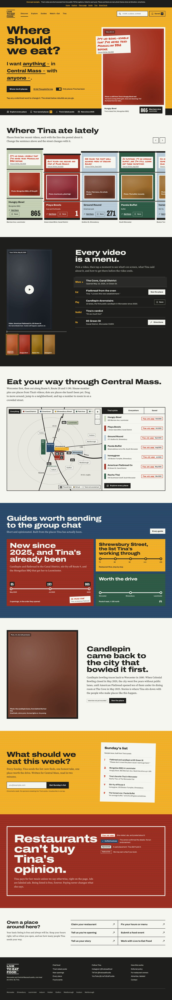 | 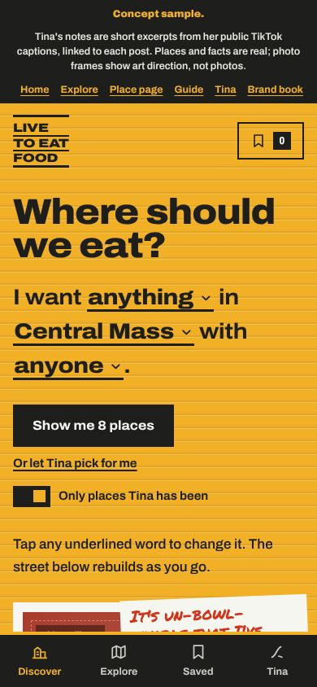 |

| Place page, desktop | Place page, phone |
|---|---|
| 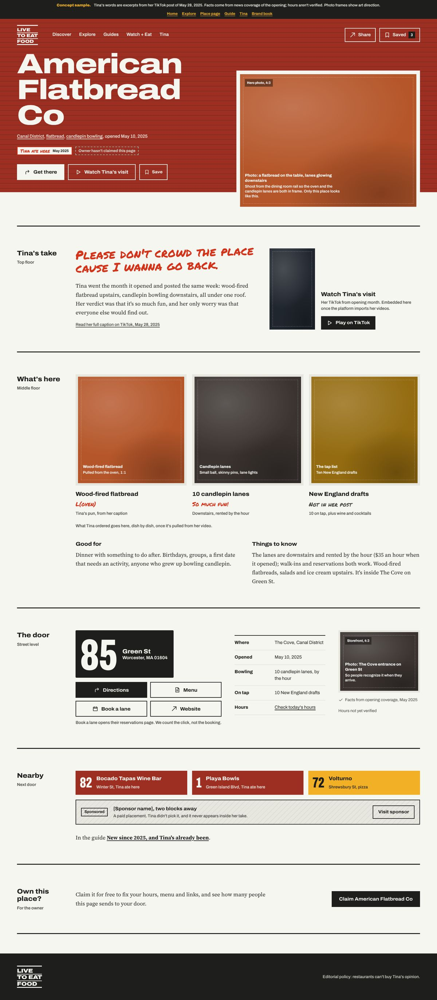 | 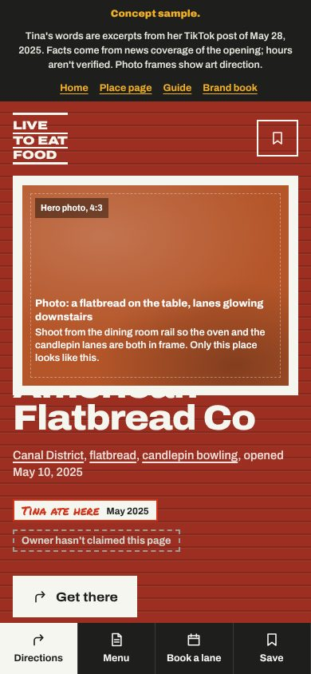 |

| Explore, desktop | Tina, desktop |
|---|---|
| 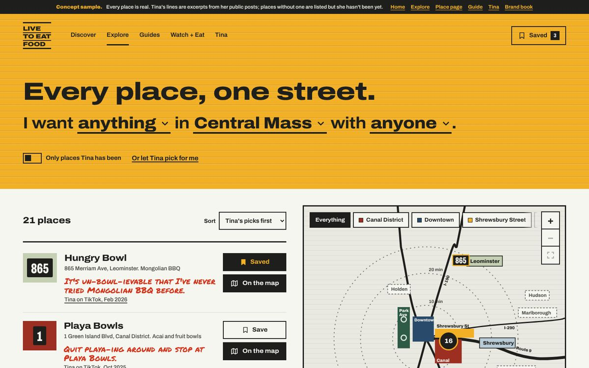 | 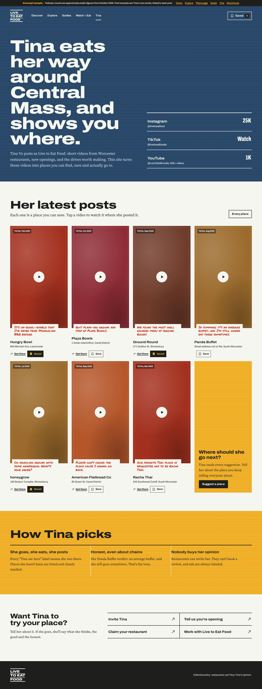 |

| Map, zoomed into Shrewsbury Street | Map, a route through saved places |
|---|---|
| 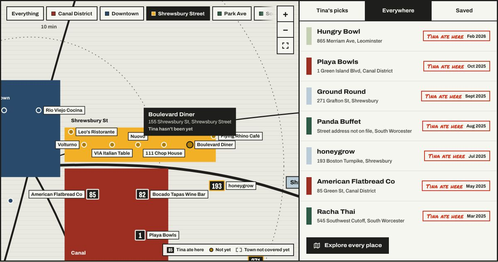 | 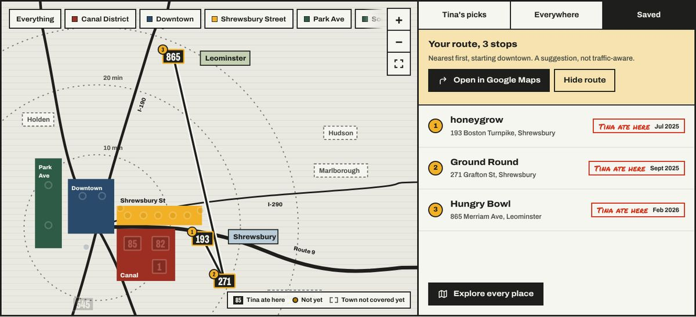 |

| Let Tina pick | Saved drawer |
|---|---|
| 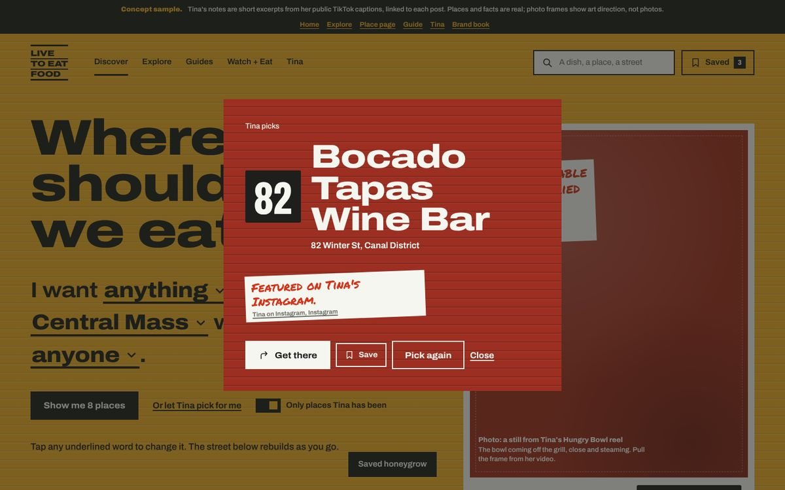 | 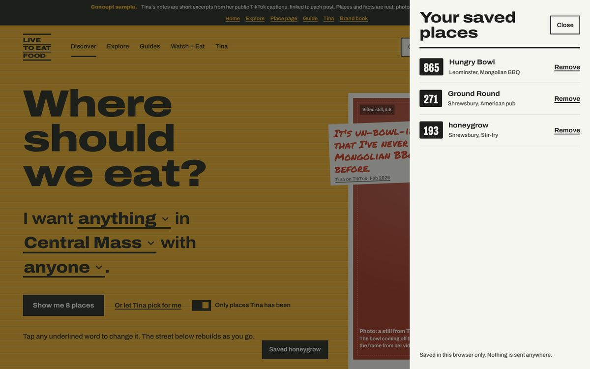 |

| "New since 2025" guide | Brand book page |
|---|---|
| 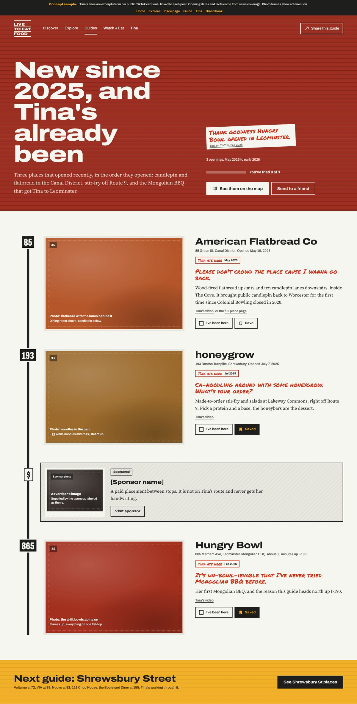 | 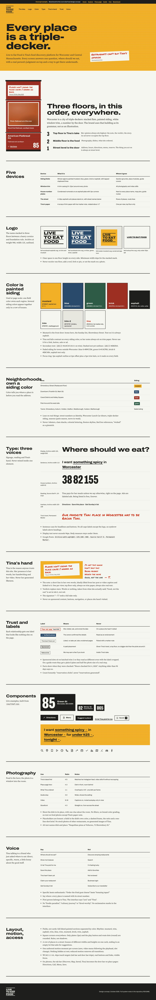 |

### What each screen proves

- **Home.** Discovery is a sentence, not a wall of filter pills. Tina's latest find leads. "Where Tina ate lately" is a street of uneven houses ending in an empty lot. Watch + Eat turns a reel into a timestamped menu. The map is schematic and branded, with towns on drive-time rings. Guides are routes. The Sunday list is a paper list. The editorial policy is a painted sign. The owner path sits quietly at the bottom.
- **Place page.** Someone in the Canal District at 6:30 pm sees Tina's line first, then what's there, then the door: address plate, Directions, Menu, Book a lane, the facts and when they were checked. On phones the tab bar becomes a door bar.
- **Explore.** The same sentence over every place on file. Tina's places carry her line in her hand; the rest carry one sourced fact and a dashed "Tina hasn't been yet" label, never an invented opinion.
- **Tina.** Her accounts, her latest posts as places you can save, and the three rules she picks by.
- **Guide.** Three recent openings Tina has posted about, in the order they opened, as a route of house numbers. The sponsored stop is hatched, smaller and off-route.

---

## 16. Content, facts and sources

### Tina's posts used on the site

Her words appear only as short excerpts from her public TikTok captions, linked to the post. Dates are decoded from each post's ID. Instagram, TikTok and YouTube block automated reading, so these came from search-engine indexes of her captions; her own analytics or an export would give many more.

| Place | Address | Tina's line (excerpt) | Post |
|---|---|---|---|
| Hungry Bowl | 865 Merriam Ave, Leominster | "It's un-bowl-ievable that I've never tried Mongolian BBQ before." | [TikTok, Feb 2026](https://www.tiktok.com/@livetoeatfoodie/video/7604965242379996430) |
| American Flatbread Co | 85 Green St, Worcester 01604 | "Please don't crowd the place cause I wanna go back." | [TikTok, May 2025](https://www.tiktok.com/@livetoeatfoodie/video/7509509382808292651) |
| Racha Thai | 545 Southwest Cutoff, Worcester | "Our favorite Thai place in Worcester has to be Racha Thai" | [TikTok, Mar 2025](https://www.tiktok.com/@livetoeatfoodie/video/7486636461693979946) |
| honeygrow | 193 Boston Turnpike, Shrewsbury | "Ca-noodling around with some honeygrow - what's your order??" | [TikTok, Jul 2025](https://www.tiktok.com/@livetoeatfoodie/video/7532590916696132919) |
| Ground Round | 271 Grafton St, Shrewsbury | "We found the most well rounded menu at Ground Round!" | [TikTok, Sept 2025](https://www.tiktok.com/@livetoeatfoodie/video/7554878364746648846) |
| Playa Bowls | 1 Green Island Blvd, Worcester | "Quit playa-ing around" | [TikTok, Oct 2025](https://www.tiktok.com/@livetoeatfoodie/video/7558980619980541197) |
| Panda Buffet | Worcester (address not confirmed) | "an average buffet…and I'm still gonna eat there sometimes" | [TikTok, Aug 2025](https://www.tiktok.com/@livetoeatfoodie/video/7537763472541584653) |
| Bocado Tapas Wine Bar | 82 Winter St, Worcester | Featured on her Instagram (from the strategy research) | [Instagram](https://www.instagram.com/livetoeatfood/) |

Not used: her YouTube video "The Ultimate Worcester Food Guide with Tina Vo" (YouTube rate-limited the request, so its contents weren't read), and Wholly Cannoli, which closed in 2024.

### Facts from other sources

- American Flatbread Co: opened May 2025 inside The Cove in the Canal District; 10 candlepin lanes downstairs, restaurant upstairs; wood-fired flatbreads, salads, ice cream; 10 New England drafts; lanes $35 an hour at opening; first public candlepin in Worcester since Colonial Bowling closed in May 2020 — [Worcester Business Journal](https://www.wbjournal.com/article/candlepin-bowling-returns-to-worcester-as-american-flatbread-set-to-open-on-saturday), [Spectrum News](https://spectrumnews1.com/ma/worcester/news/2025/05/15/american-flatbread-candlepin-bowling-051525) (also the source for candlepin's 1880 Worcester origin).
- honeygrow Shrewsbury: 193 Boston Turnpike, Lakeway Commons, opened July 7, 2025 — [QSR Magazine](https://www.qsrmagazine.com/news/honeygrow-opens-in-shrewsbury-massachusetts/)
- Racha Thai: 545 Southwest Cutoff #2, The Worcester Fair; price range $15–30 — [Toast](https://toast.app/r/racha-thai-worcester)
- Bocado Tapas Wine Bar, 82 Winter St — [OpenTable](https://www.opentable.ie/bocado-tapas-wine-bar-worcester)
- Shrewsbury Street addresses (Volturno 72, VIA 89, Nuovo 92, 111 Chop House 111, Boulevard Diner 155) — [Discover Central MA](https://www.discovercentralma.org/articles/post/shrewsbury-street/)

### Places Tina hasn't posted about (listed, no opinion)

These fill out the map and Explore. Each shows a fact from the source, never a take.

| Place | Address | Fact used | Source |
|---|---|---|---|
| Chashu Ramen + Izakaya | 38 Franklin St, Worcester | Ramen and izakaya, downtown | [Worcester Business Journal](https://www.wbjournal.com/article/chashu-ramen-izakaya-opens-in-worcester) |
| Rio Viejo Cocina | 50 Franklin St, Worcester | Owner Jaime Avila started with the Taco Libre food truck | [Worcester Business Journal](https://wbjournal.com/article/new-mexican-restaurant-opens-in-worcester/) |
| George's Coney Island Hot Dogs | 158 Southbridge St, Worcester | Open since 1918; neon sign from 1938 | [Fifty Plus Advocate](https://www.fiftyplusadvocate.com/2024/10/07/coney-island-hot-dogs-has-been-a-worcester-institution-for-more-than-a-century), [NBC Boston](https://www.nbcboston.com/news/local/georges-coney-island-in-worcester-to-restore-iconic-hot-dog-sign/3598633/) |
| Boulevard Diner | 155 Shrewsbury St, Worcester | Worcester Lunch Car Company car no. 730, 1936 | [Wikipedia](https://en.wikipedia.org/wiki/Boulevard_Diner) |
| Pho Dakao | 593 Park Ave, Worcester | Pho, noodle soups and vermicelli | [Allmenus](https://www.allmenus.com/ma/worcester/42524-pho-dakao/menu/) |
| Baba Sushi | 309 Park Ave, Worcester | Sushi on Park Ave | [Toast](https://www.toasttab.com/local/order/baba-sushi-worcester-309-park-ave/item-_a0a14afd-6e53-48d7-8629-129c4314d6cb) |
| Volturno, VIA Italian Table, Nuovo, 111 Chop House, Flying Rhino Café, Leo's Ristorante | Shrewsbury Street | Restaurant Row addresses | [Discover Central MA](https://www.discovercentralma.org/articles/post/shrewsbury-street/) |
| Wormtown Brewery | 72 Shrewsbury St, Worcester | Shares the address with Volturno | [Wormtown Brewery](https://www.wormtownbrewery.com/worcester-taproom) |

### Still placeholder

- Every photo and video still (shot briefs describe what to pull from her videos).
- Watch + Eat timestamps (filled in when a video is imported).
- What Tina ordered at American Flatbread, dish by dish.
- Hours for every place (none are verified), and price bands where none is listed.
- The Stories interview, the sponsor, and the drive-time rings (approximate). Map positions are schematic, not to scale.
- Hours for American Flatbread Co (not verified).

## 17. Repository structure

```
.
├── index.html          Home concept
├── explore.html        Every place, filterable, with the map
├── tina.html           About Tina and her latest posts
├── place.html          Place page concept (American Flatbread Co)
├── guide.html          Guide concept (New since 2025)
├── brand.html          Brand book page
├── css/
│   ├── ltef.css        All tokens and component styles
│   └── interactive.css Save, drawer, dialog, listbox, street, map pins, explore, Tina page
├── js/
│   ├── places.js       The data: 21 places, areas, cravings, Tina's posts, video moments
│   └── app.js          All interactions (vanilla JS, no dependencies)
├── assets/logos/       Outlined SVG logo files
├── design/
│   └── tokens.json     Color, type, spacing, radius and border tokens
├── docs/screens/       Screenshots used in this README
└── .nojekyll           Serve files as-is on GitHub Pages
```

**Run locally:** open `index.html` in a browser, or serve the folder (`python3 -m http.server`) and visit `http://localhost:8000`. No build step and no dependencies. The street, map pins, Explore rows and Tina's feed are drawn by `js/app.js` from `js/places.js`, so JavaScript needs to be on. To add a place, add an entry to `js/places.js`. Fonts load from Google Fonts.

**GitHub Pages:** Settings → Pages → Deploy from a branch → `main` / `(root)`.

---

## 18. Toward the WordPress build

The concept is static HTML on purpose: the design is proven before any CMS decisions. When the build starts:

- **Theme:** a block theme. Map `design/tokens.json` into `theme.json` (`settings.color.palette`, `settings.typography.fontFamilies` and `fontSizes`, `settings.spacing.spacingSizes`), and keep `css/ltef.css` component rules as block styles and patterns.
- **Content model** (custom post types and taxonomies): Restaurants (address, street number, area, cuisine, price band, hours, menu/reserve/order URLs, claim status, last-verified date), Tina's takes and dish verdicts, Videos (with timestamped moments linked to dishes), Guides (ordered stops), People stories, Events, Towns/Neighborhoods (each with its siding color), Cuisines.
- **Interactions:** `js/places.js` mirrors the content model, so `js/app.js` can move to a block theme's view script reading the same fields from the REST API.
- **Patterns:** House, Address plate, Craving sentence, Watch + Eat menu, Route stop, Policy sign, Sunday list signup.
- **Rules to enforce in the editor:** sponsored blocks can't use the Tina note style; "Tina ate here" requires a visit date; Restaurant schema (`schema.org/Restaurant`) generated from the same fields shown on the page.

---

*Design concept, October 2026. Built for Tina Vo and Live to Eat Food by Jeremy Anderson.*
